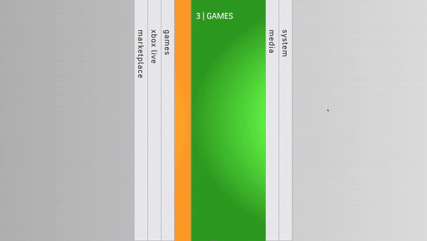

# Xbox 360 Blades Slider

Basic implementation of Xbox 360 Blades Dashboard slider in vanilla JavaScript.
No dependencies.
A more advanced implementation like the stacked bending buttons would require something like [<canvas>](https://developer.mozilla.org/en-US/docs/Web/API/Canvas_API).
